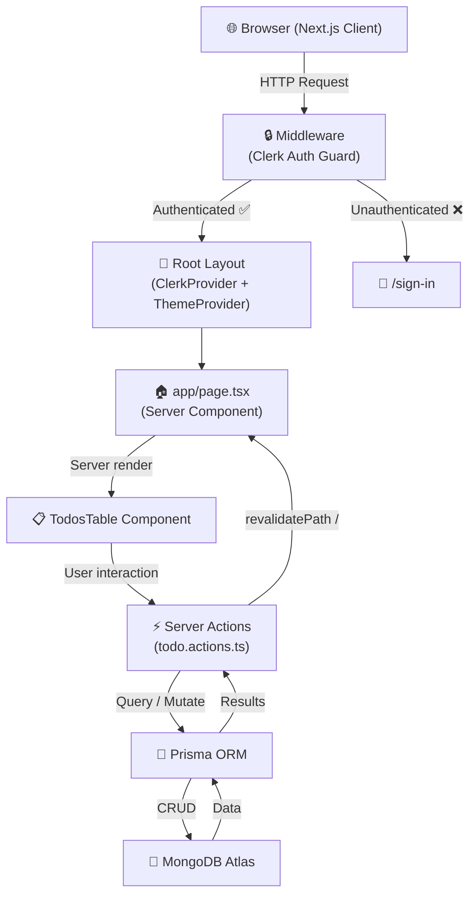

<div align="center">


<br/>

[](https://nextjs.org/)
[](https://www.typescriptlang.org/)
[](https://www.mongodb.com/)
[](https://www.prisma.io/)
[](https://clerk.com/)
[](https://tailwindcss.com/)
[](https://react.dev/)

</div>

---

## 📖 About

**Fullstack Next.js Todo App** is a production-ready task management application built with the modern full-stack ecosystem. It combines **Next.js 15 App Router**, **Server Actions**, **MongoDB + Prisma ORM**, and **Clerk Authentication** to deliver a seamless, secure, and responsive todo experience with full dark-mode support.

---

## ✨ Features

| Feature | Description |
|---|---|
| 🔐 **Authentication** | Secure sign-up / sign-in via [Clerk](https://clerk.com/) — all routes are protected by middleware |
| ➕ **Create Todos** | Add a todo with a title (required) and an optional description |
| ✏️ **Edit Todos** | Update any todo's title, description, or completion status |
| 🗑️ **Delete Todos** | Remove a todo with a single click |
| ✅ **Toggle Status** | Instantly flip a todo between *pending* and *completed* via a checkbox |
| 🌓 **Dark / Light Mode** | System-aware theme with manual override via a dropdown toggle |
| ⚡ **Server Actions** | All CRUD operations run as Next.js Server Actions — no separate API layer needed |
| 📋 **Zod Validation** | Form data is validated client-side with **React Hook Form** + **Zod** before submission |
| 💅 **Shadcn UI** | Beautiful, accessible components (Dialog, Table, Badge, Button, Checkbox, …) built on Radix UI |
| 🎞️ **Animations** | Smooth `fadeIn`, `slideUp`, and `bounceSubtle` CSS animations on key UI elements |

---

## 🗂️ Project Structure

```
fullstack-nextjs-todo-app/
├── app/
│   ├── layout.tsx          # Root layout – ClerkProvider + ThemeProvider + Geist font
│   ├── page.tsx            # Home page – renders the todo table
│   ├── globals.css         # Global styles, CSS variables (light/dark), custom animations
│   ├── error.tsx           # Error boundary
│   ├── sign-in/            # Clerk hosted sign-in page
│   └── sign-up/            # Clerk hosted sign-up page
├── actions/
│   └── todo.actions.ts     # Server Actions: getTodos, create, update, delete, toggle
├── components/
│   ├── AddTodoForm.tsx     # Dialog + form for creating a new todo
│   ├── EditTodoForm.tsx    # Dialog + form for editing an existing todo
│   ├── TodosTable.tsx      # Main table with status icons, badges, dates & empty state
│   ├── TodoTableActions.tsx# Edit / Delete action buttons per row
│   ├── Navbar.tsx          # Fixed top nav – logo, theme toggle, Clerk auth
│   ├── ModeToggle.tsx      # Light / Dark / System theme switcher
│   ├── Spinner.tsx         # SVG loading spinner (animate-spin)
│   └── ui/                 # Shadcn UI components (button, dialog, form, table, …)
├── interfaces/
│   └── index.ts            # ITodo TypeScript interface
├── lib/
│   └── utils.ts            # cn() – Tailwind class merging utility
├── schema/
│   └── index.ts            # Zod schema for todo create / edit forms
├── providers/
│   └── theme-provider.tsx  # next-themes ThemeProvider wrapper
├── prisma/
│   ├── schema.prisma       # MongoDB Todo model
│   └── seed.ts             # Database seeder using @faker-js/faker
├── middleware.ts            # Clerk route-protection middleware
└── public/                 # Static assets
```

---

## 🏗️ Architecture & Data Flow



---

## 🗄️ Database Schema

```prisma
model Todo {
  id        String   @id @default(auto()) @map("_id") @db.ObjectId
  title     String                  // Required — max 30 characters
  body      String?                 // Optional description — max 80 characters
  completed Boolean  @default(false)
  user_id   String                  // Linked to authenticated Clerk user
  createdAt DateTime @default(now())
}
```

> Todos are scoped per user — each query filters by the authenticated user's `userId` from Clerk.

---

## 🎞️ Animations

Custom CSS animations are defined in `app/globals.css` and powered by **tw-animate-css**:

| Class | Keyframe | Duration | Usage |
|---|---|---|---|
| `animate-fade-in` | `fadeIn` (opacity 0 → 1) | 0.5 s | Page / component mounts |
| `animate-slide-up` | `slideUp` (translateY 10px → 0 + fade) | 0.3 s | Todo rows entering the table |
| `animate-bounce-subtle` | `bounceSubtle` (gentle ±4 px bounce) | 0.6 s | Action feedback |
| `animate-spin` | Built-in Tailwind spin | infinite | `Spinner` loading component |

---

## 🚀 Getting Started

### Prerequisites

- **Node.js** ≥ 18
- **npm** (or yarn / pnpm / bun)
- A **MongoDB Atlas** cluster (or local MongoDB instance)
- A **Clerk** account — create a free app at [clerk.com](https://clerk.com/)

### Installation

```bash
# 1. Clone the repository
git clone https://github.com/zeyadwaled25/fullstack-nextjs-todo-app.git
cd fullstack-nextjs-todo-app

# 2. Install dependencies
npm install

# 3. Set up environment variables (see below)
cp .env.example .env.local   # or create .env manually

# 4. Generate Prisma client
npx prisma generate

# 5. (Optional) Seed the database with fake todos
npx prisma db seed

# 6. Start the development server
npm run dev
```

Open [http://localhost:3000](http://localhost:3000) in your browser.

---

## 🔑 Environment Variables

Create a `.env` file in the project root with the following variables:

```env
# MongoDB connection string (from MongoDB Atlas or local)
DATABASE_URL="mongodb+srv://<user>:<password>@cluster.mongodb.net/<dbname>?retryWrites=true&w=majority"

# Clerk authentication keys — found in your Clerk dashboard
NEXT_PUBLIC_CLERK_PUBLISHABLE_KEY=pk_test_...
CLERK_SECRET_KEY=sk_test_...

# Clerk redirect URLs
NEXT_PUBLIC_CLERK_SIGN_IN_URL=/sign-in
NEXT_PUBLIC_CLERK_SIGN_UP_URL=/sign-up
NEXT_PUBLIC_CLERK_AFTER_SIGN_IN_URL=/
NEXT_PUBLIC_CLERK_AFTER_SIGN_UP_URL=/
```

---

## 🛠️ Available Scripts

| Script | Command | Description |
|---|---|---|
| **Dev server** | `npm run dev` | Starts Next.js with Turbopack in development mode |
| **Production build** | `npm run build` | Runs `prisma generate` then `next build` |
| **Start production** | `npm start` | Serves the production build |
| **Lint** | `npm run lint` | Runs ESLint across the project |
| **Seed DB** | `npx prisma db seed` | Seeds MongoDB with faker-generated todos |

---

## 🧰 Tech Stack

| Category | Technology |
|---|---|
| **Framework** | [Next.js 15](https://nextjs.org/) — App Router, Server Actions, Turbopack |
| **Language** | [TypeScript 5](https://www.typescriptlang.org/) |
| **Styling** | [Tailwind CSS v4](https://tailwindcss.com/) + [tw-animate-css](https://github.com/joe-bell/tw-animate-css) |
| **UI Components** | [Shadcn UI](https://ui.shadcn.com/) + [Radix UI](https://www.radix-ui.com/) |
| **Icons** | [Lucide React](https://lucide.dev/) |
| **Fonts** | [Geist](https://vercel.com/font) (via `next/font`) |
| **Authentication** | [Clerk](https://clerk.com/) |
| **Database** | [MongoDB Atlas](https://www.mongodb.com/cloud/atlas) |
| **ORM** | [Prisma 6](https://www.prisma.io/) |
| **Forms** | [React Hook Form](https://react-hook-form.com/) + [Zod](https://zod.dev/) |
| **Theme** | [next-themes](https://github.com/pacocoursey/next-themes) |

---

## 📄 License

This project is open source and available under the [MIT License](LICENSE).
